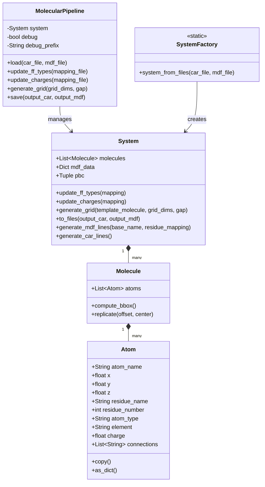

# Object-Based Architecture: UML Diagram

## Class Responsibilities

### System
- Central model representing a complete molecular system
- Stores metadata, molecules, and boundary conditions
- Provides transformation methods directly on the system
- Handles file input/output generation

### Molecule
- Represents a single molecule within the system
- Contains a collection of atoms
- Handles bounding box calculation and replication

### Atom 
- Represents a single atom with coordinates and properties
- Stores chemical information (element, charge, connections)

### MolecularPipeline
- Provides a fluent API for chaining multiple transformations
- Loads/saves files at beginning/end of pipeline
- Supports debug output for intermediate steps
- Delegates transformations to System methods

### SystemFactory
- Static factory methods for creating System objects
- Simplifies loading from different file formats