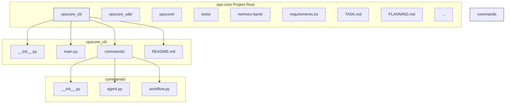

# Ops-Core CLI Development Plan (Task 3.2)

## 1. Goal
Develop a command-line interface (CLI) application using Python to allow users to interact with the Ops-Core API via the `opscore_sdk`. This will provide a direct way to manage agent states and trigger workflows without needing to make raw API calls.

## 2. Technology Choice
*   **Language:** Python
*   **CLI Framework:** `click` - A popular, composable, and user-friendly library for building CLIs in Python.
*   **SDK:** The existing `opscore_sdk` package.

## 3. Location & Structure
A new directory `opscore_cli/` will be created at the root of the project.

## 4. Dependencies
*   Add `click` to `requirements.txt`.
*   The CLI will implicitly depend on `opscore_sdk` (and its dependencies like `httpx`).

## 5. Configuration
*   The CLI will need the Ops-Core API URL and potentially an API Key.
*   These will be configured using environment variables:
    *   `OPSCORE_API_URL` (e.g., `http://localhost:8000`)
    *   `OPSCORE_API_KEY` (if required by the target endpoints)

## 6. Proposed Commands
The CLI will be structured using `click` groups and commands:

*   `opscore-cli agent get-state <AGENT_ID>`
    *   Uses `OpsCoreClientSync.get_agent_state`.
*   `opscore-cli agent update-state <AGENT_ID> <STATE> [--details <JSON_STRING>]`
    *   Uses `OpsCoreClientSync.update_agent_state`. `<STATE>` should match `AgentState` enum values (e.g., `idle`, `active`, `error`).
*   `opscore-cli workflow trigger <AGENT_ID> <WORKFLOW_NAME> [--payload <JSON_STRING>]`
    *   Uses `OpsCoreClientSync.trigger_workflow`.

## 7. Implementation Details
*   The main entry point will be in `opscore_cli/main.py`.
*   Command logic will reside in `opscore_cli/commands/agent.py` and `opscore_cli/commands/workflow.py`.
*   Commands will instantiate `OpsCoreClientSync`, read configuration from environment variables, call the appropriate SDK methods, and print results or errors to the console.
*   SDK exceptions (`OpsCoreSDKError`, `OpsCoreApiError`) will be caught and presented as user-friendly error messages.
*   A basic `opscore_cli/README.md` will document setup and usage.

## 8. Clarification on Agent Registration
*   Based on the current API (`opscore/api.py`) and system design (`memory-bank/systemPatterns.md`), agent registration is handled implicitly when AgentKit sends a webhook notification to the internal `/v1/opscore/internal/agent/notify` endpoint.
*   Therefore, **this CLI will *not* include a direct agent registration command**, as there is no public API endpoint or SDK function for it. The CLI will focus on interacting with agents already known to Ops-Core.