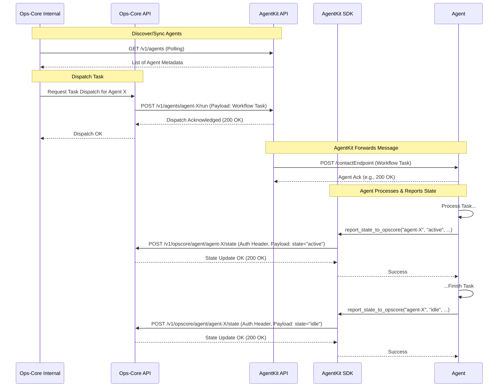

# AgentKit Integration Guide for Ops-Core Developers

## 1. Introduction

### Purpose
This document provides Ops-Core developers with the necessary technical details to integrate the Ops-Core system with the AgentKit Python module. It outlines AgentKit's relevant APIs, expected data formats, communication protocols, and interaction patterns required for Ops-Core to effectively manage agent lifecycles and dispatch tasks to agents built with AgentKit.

### Scope
This guide focuses on the AgentKit side of the integration, detailing how Ops-Core should interact with AgentKit's APIs and what Ops-Core needs to provide for agents to report their status back.

### AgentKit Overview
AgentKit is a Python module designed for the rapid development and prototyping of AI agents. Its core responsibilities include:
*   **Agent Registration:** Providing an API endpoint (`POST /v1/agents/register`) for agents to register themselves and their metadata (capabilities, version, contact endpoint).
*   **Message Routing:** Offering a central API endpoint (`POST /v1/agents/{agentId}/run`) to receive messages intended for specific agents. AgentKit routes these messages to the agent's registered HTTP `contactEndpoint`.
*   **Tool Execution:** Handling `tool_invocation` message types internally by calling registered tools.
*   **SDK:** Providing a Python client library (`agentkit.sdk`) for developers to build agents that interact with the AgentKit API and, as of recent updates, directly with Ops-Core for state reporting.

### References
*   **AgentKit README:** [../README.md](../README.md)
*   **AgentKit API Docs:** Access `/docs` (Swagger) or `/redoc` on a running AgentKit instance (e.g., `http://localhost:8000/docs`).
*   **AgentKit Planning:** [../PLANNING.md](../PLANNING.md) (for architectural context).
*   **AgentKit Configuration:** [configuration.md](configuration.md)

## 2. Integration Points & Responsibilities

### Agent Registration Data
-   **Ops-Core Need:** To manage agents, Ops-Core must know which agents are registered with AgentKit and retrieve their essential metadata, particularly `agentId`, `capabilities`, and `contactEndpoint`.
-   **Mechanism Recommendation:** Ops-Core should periodically poll AgentKit's agent listing endpoint to discover registered agents and synchronize metadata.
    *   **AgentKit Endpoint:** `GET /v1/agents` (Note: This endpoint needs to be confirmed or implemented in AgentKit if not already present. Assuming it exists for this guide).
    *   **Expected Response Format (Example):**
        ```json
        {
          "status": "success",
          "message": "Agents retrieved successfully.",
          "data": [
            {
              "agentId": "agent-123",
              "agentName": "ExampleAgent",
              "version": "1.0",
              "capabilities": ["process_text", "use_calculator"],
              "contactEndpoint": "http://agent-service:8001/",
              "registrationTime": "2024-01-01T10:00:00Z",
              "metadata": {"description": "..."}
            },
            // ... other agents
          ]
        }
        ```
-   **Data Model:** The structure corresponds to AgentKit's internal representation, likely based on `agentkit.core.models.AgentInfo`.

### Dispatching Tasks/Messages to Agents
-   **Mechanism:** Ops-Core **must** dispatch tasks or commands to specific agents by sending a POST request to AgentKit's central messaging endpoint: `POST /v1/agents/{agentId}/run`.
-   **AgentKit's Role:** AgentKit acts as a message router. Upon receiving a request at `/run`:
    1.  It identifies the target agent using the `{agentId}` from the URL.
    2.  It looks up the agent's registered `contactEndpoint`.
    3.  It forwards the entire JSON request body (containing sender, type, payload, context) as a POST request to the agent's `contactEndpoint`.
-   **Required Request Payload for AgentKit `/run`:** Ops-Core must structure its request body as follows:
    ```json
    {
      "senderId": "opscore_system_id", // Use a consistent, designated ID for Ops-Core
      "messageType": "workflow_task", // Or another type agreed upon for Ops-Core tasks
      "payload": {
        // --- Ops-Core specific task details ---
        "task_name": "...",
        "task_parameters": { ... },
        // --- etc. ---
      },
      "sessionContext": { // Optional, for tracking
        "workflowId": "...",
        "sessionId": "..."
      }
    }
    ```
-   **Response Handling:** The synchronous HTTP response (e.g., 200 OK) received from AgentKit's `/run` endpoint only confirms that AgentKit successfully *attempted* to dispatch the message to the agent's `contactEndpoint`. It **does not** indicate that the agent has successfully processed the task. The agent's processing status must be tracked via the state updates sent directly from the agent to Ops-Core (see next section).

### Receiving Agent State Updates
-   **Mechanism:** Ops-Core **must** implement and expose a dedicated API endpoint to receive direct state updates from AgentKit agents. The AgentKit SDK is configured to send these updates to: `POST /v1/opscore/agent/{agentId}/state`.
-   **AgentKit's Role:** AgentKit is **not** involved in proxying these state updates. Agents use the AgentKit SDK (`report_state_to_opscore` method), which reads the `OPSCORE_API_URL` environment variable and makes a direct HTTP POST request to Ops-Core.
-   **Expected Request Payload at Ops-Core `/state` Endpoint:** Ops-Core must expect and validate the following JSON structure:
    ```json
    {
      "agentId": "string", // ID of the agent reporting state
      "timestamp": "string", // ISO 8601 format UTC timestamp (e.g., "2024-01-01T12:00:00.123456+00:00")
      "state": "string", // The state being reported (e.g., "initializing", "idle", "active", "error")
      "details": { ... } // Optional, arbitrary JSON object for additional context (e.g., error messages, task progress)
    }
    ```
-   **Authentication:** Ops-Core's `/state` endpoint **must** implement authentication. The AgentKit SDK sends an API key (read from the `OPSCORE_API_KEY` environment variable) in the `Authorization` header as a Bearer token. Ops-Core must validate this token.
    *   **Expected Header:** `Authorization: Bearer <OPSCORE_API_KEY_value>`
-   **Required Responses from Ops-Core `/state` Endpoint:**
    *   **Success:** Return `200 OK` or `202 Accepted` with an optional simple JSON body like `{"status": "success"}`.
    *   **Client Errors:**
        *   `400 Bad Request`: If the payload is malformed or fails schema validation. Include error details in the response body.
        *   `401 Unauthorized`: If the `Authorization` header is missing or the token is invalid.
        *   `404 Not Found`: If the `{agentId}` in the URL is unknown to Ops-Core (though this might also be handled as a 400).
    *   **Server Errors:**
        *   `500 Internal Server Error`: If Ops-Core fails to process the state update due to an internal issue.

## 3. Sequence Diagram (Ops-Core Perspective)



## 4. Implementation Checklist for Ops-Core

-   [ ] **Agent Discovery:** Implement logic to periodically poll AgentKit's `GET /v1/agents` endpoint (confirm endpoint availability/details with AgentKit team) and synchronize agent metadata (`agentId`, `contactEndpoint`, `capabilities`).
-   [ ] **Task Dispatch:** Implement logic to construct valid JSON request bodies and send POST requests to AgentKit's `POST /v1/agents/{agentId}/run` endpoint. Use a designated `senderId` for Ops-Core. Handle responses appropriately (treat 2xx as successful dispatch attempt).
-   [ ] **State Update Endpoint:** Implement the `POST /v1/opscore/agent/{agentId}/state` endpoint:
    -   [ ] Verify `Content-Type: application/json`.
    -   [ ] Implement Authentication: Extract Bearer token from `Authorization` header and validate it. Return `401 Unauthorized` if invalid/missing.
    -   [ ] Implement Payload Validation: Parse the JSON body and validate it against the expected schema (agentId, timestamp, state, details). Return `400 Bad Request` on failure.
    -   [ ] Implement State Processing Logic: Update Ops-Core's internal representation of the agent's state based on the validated payload.
    -   [ ] Return Success Response: Return `200 OK` or `202 Accepted` on successful processing.
    -   [ ] Return Server Error Response: Return `500 Internal Server Error` if internal processing fails.
-   [ ] **Error Handling:** Implement robust error handling for network issues or non-success responses when calling AgentKit APIs.
-   [ ] **Configuration:** Allow configuration of the AgentKit API base URL within Ops-Core.

## 5. Appendix: Schema Definitions (Placeholder)

*(This section should ideally contain formal OpenAPI/JSON Schema definitions)*

### AgentKit `/run` Endpoint Request Body Schema (Informal)
```json
{
  "type": "object",
  "properties": {
    "senderId": {"type": "string", "description": "Identifier of the message sender (e.g., 'opscore_system_id')"},
    "messageType": {"type": "string", "description": "Type of message (e.g., 'workflow_task')"},
    "payload": {"type": "object", "description": "Message content specific to the messageType"},
    "sessionContext": {"type": ["object", "null"], "description": "Optional context for session tracking"}
  },
  "required": ["senderId", "messageType", "payload"]
}
```

### Ops-Core `/state` Endpoint Expected Request Body Schema (Informal)
```json
{
  "type": "object",
  "properties": {
    "agentId": {"type": "string", "description": "ID of the agent reporting state"},
    "timestamp": {"type": "string", "format": "date-time", "description": "ISO 8601 UTC timestamp"},
    "state": {"type": "string", "description": "Reported state (e.g., idle, active, error)"},
    "details": {"type": ["object", "null"], "description": "Optional dictionary for additional context"}
  },
  "required": ["agentId", "timestamp", "state"]
}