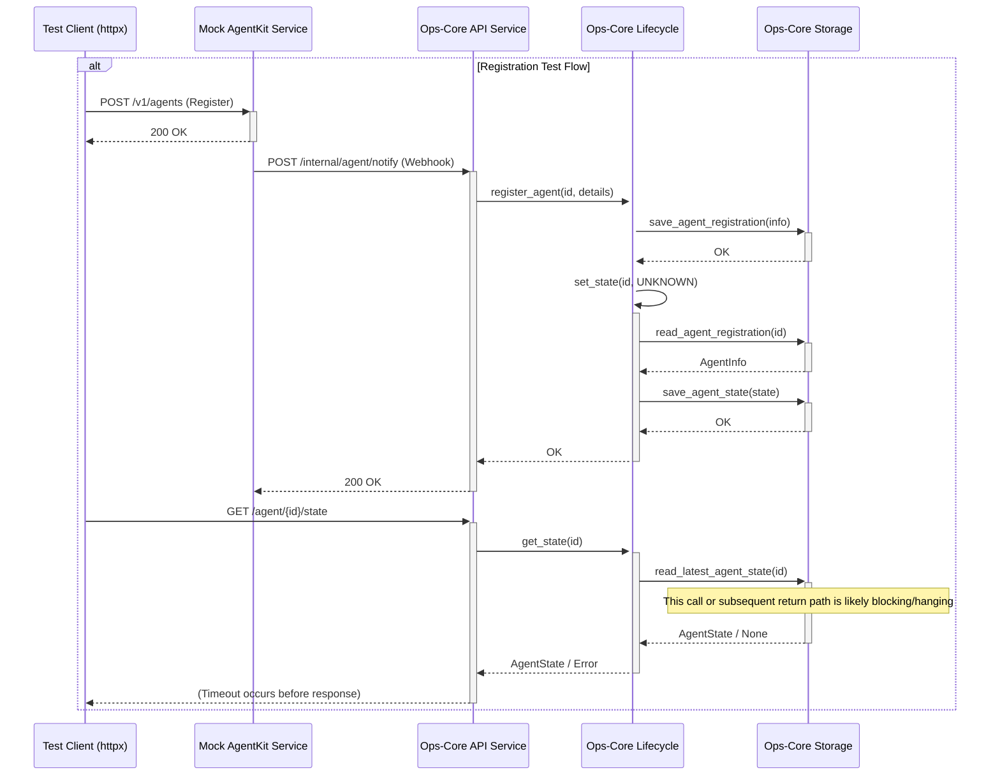

# Debugging Plan: httpx.ReadTimeout in AgentKit Integration Tests

**Objective:** Diagnose and identify the root cause of the `httpx.ReadTimeout` errors occurring in `tests/test_agentkit_integration.py` when the test client attempts to fetch agent state via `GET /v1/opscore/agent/{agent_id}/state` after webhook registration or state update callbacks.

## 1. Hypotheses

The timeout suggests the `GET /state` request handler is blocking for longer than the 10-second test timeout. Potential causes include:

*   An issue within the `opscore.lifecycle.get_state` function itself (beyond the storage call).
*   An issue within the FastAPI request handling for `GET /state` (e.g., async/sync interaction, thread pool exhaustion).
*   An unexpected behavior or delay in the mock AgentKit service (`mock_agentkit/main.py`) affecting the overall flow.
*   Networking issues within the Docker environment.
*   (Less Likely): Lock contention within `opscore.storage` (locks seem brief for in-memory ops).

## 2. Debugging Strategy

Trace the execution flow using logs to pinpoint where the delay occurs:

1.  **Start Services:** Ensure `opscore_service` and `agentkit_service` are running via `docker-compose up --build -d`.
2.  **Run Tests:** Execute the failing tests verbosely: `pytest -sv tests/test_agentkit_integration.py`.
3.  **Analyze Logs:** Examine the logs from both services (`docker-compose logs opscore_service` and `docker-compose logs agentkit_service`) immediately after the test run (especially after a timeout). Look for:
    *   Confirmation that the mock AgentKit *sent* the webhook/callback.
    *   Confirmation that the Ops-Core API *received* the webhook/callback.
    *   Confirmation that the relevant `lifecycle` and `storage` functions were called *and completed* for the webhook/callback.
    *   Confirmation that the `GET /state` request was *received* by the Ops-Core API.
    *   Confirmation that `lifecycle.get_state` and `storage.read_latest_agent_state` were called *and completed* for the `GET /state` request.
    *   Any Python tracebacks or error messages in either log.
4.  **Add Logging (If Needed):** If existing logs are insufficient, add specific `logger.debug` statements before and after key function calls (e.g., `lifecycle.get_state`, `storage.read_latest_agent_state`, API request/response handling) to narrow down the blocking point.

## 3. Visualize Interaction (Expected Flow)

## 4. Next Steps

After documenting this plan:

1.  Request a switch to Debug mode.
2.  Execute the "Debugging Strategy" steps.