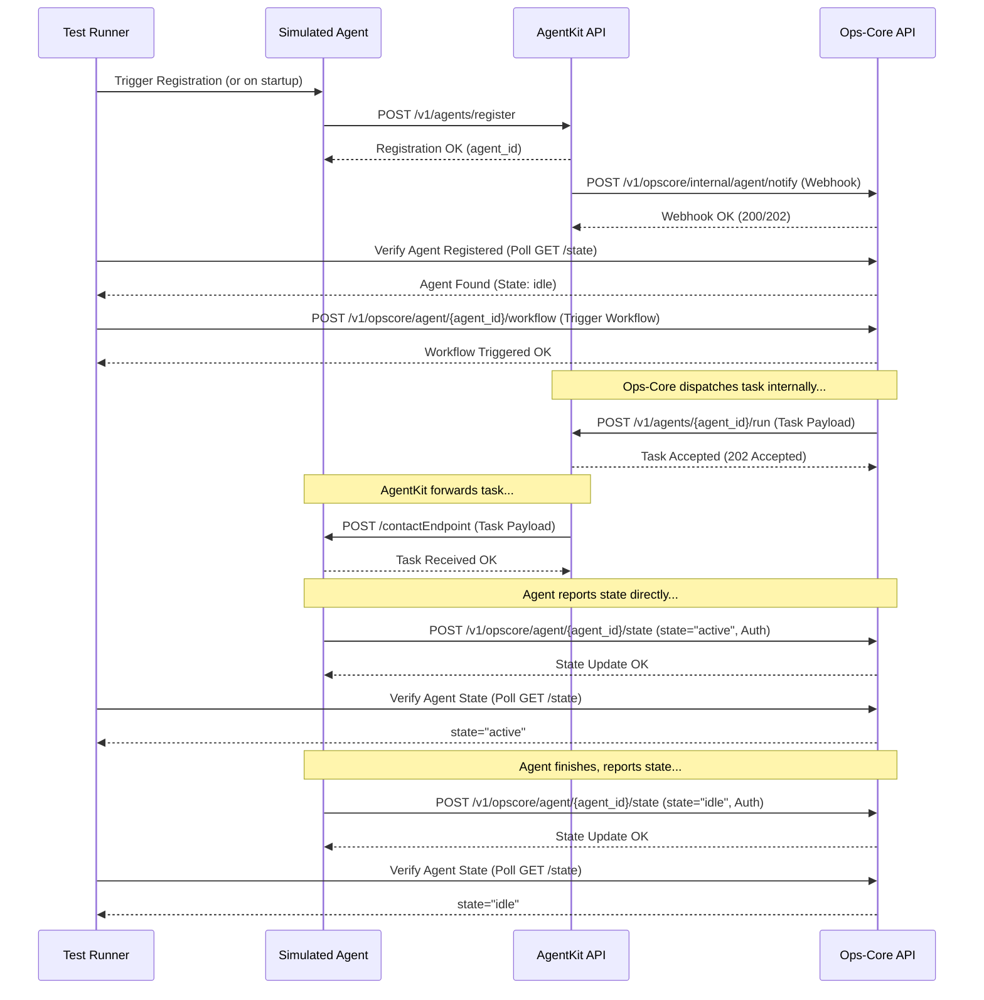

# Integration Test Plan: Task 4.2 - Real AgentKit Workflow Simulation

## 1. Goal

To create robust integration tests that verify the end-to-end communication and workflow execution between Ops-Core and the real AgentKit service, ensuring they function correctly together as per the integration design (`docs/agentkit_integration_for_opscore_V2.md`).

## 2. Test Environment

*   **Services:** Ops-Core, Real AgentKit (cloned from repo), Simulated Agent.
*   **Configuration:** Run using `docker-compose -f docker-compose.real-agentkit.yml up`.
*   **Framework:** `pytest`, `pytest-asyncio`, `httpx`.

## 3. Simulated Agent Service

A new service (`simulated_agent`) needs to be added to `docker-compose.real-agentkit.yml`.

*   **Purpose:** Acts as a minimal agent using the AgentKit SDK. It will:
    *   Register itself with AgentKit on startup or via a trigger.
    *   Expose an endpoint (`/contactEndpoint`) for AgentKit to forward tasks.
    *   Receive tasks and simulate processing.
    *   Report state changes (`active`, `idle`, `error`) directly to Ops-Core's `/v1/opscore/agent/{agentId}/state` endpoint using the SDK's `report_state_to_opscore` method (requires `OPSCORE_API_URL`, `OPSCORE_API_KEY`).
*   **Implementation:**
    *   Simple FastAPI application (e.g., `tests/simulated_agent/main.py`).
    *   Requires `agentkit` SDK, `fastapi`, `uvicorn`, `httpx`.
    *   Needs its own `Dockerfile` or use a base Python image.
*   **Docker Compose:** Add service definition to `docker-compose.real-agentkit.yml` with necessary environment variables, volumes, and dependencies.

## 4. Test Plan (`tests/integration/test_real_agentkit_workflow.py`)

### 4.1. Fixtures

*   `docker_compose_up`: Module-scoped fixture to manage `docker-compose -f docker-compose.real-agentkit.yml up -d --build` and `down`. Ensures services are running.
*   `opscore_client`: `httpx.AsyncClient` pointing to Ops-Core service URL (`http://localhost:8000`).
*   `agentkit_client`: `httpx.AsyncClient` pointing to AgentKit service URL (`http://localhost:8001`).
*   `simulated_agent_id`: A fixture providing a unique ID for the agent in each test run.

### 4.2. Core Test Scenario (`test_end_to_end_workflow`)

1.  **Setup:**
    *   Wait for all services (Ops-Core, AgentKit, Simulated Agent) to be healthy (e.g., poll `/health` endpoints).
    *   Use the `simulated_agent_id` fixture.
    *   Define a simple workflow definition.
2.  **Agent Registration:**
    *   Ensure the Simulated Agent registers itself with AgentKit (this might happen automatically on its startup).
    *   **Verification:** Poll Ops-Core's API (`GET /v1/opscore/agent/{simulated_agent_id}/state`) until the agent is found (indicating the webhook was received and processed). Use a reasonable timeout.
3.  **Workflow Trigger:**
    *   Use `opscore_client` to trigger the workflow: `POST /v1/opscore/agent/{simulated_agent_id}/workflow`.
    *   **Verification:** Assert a successful response (e.g., 200 OK).
4.  **Task Processing & State Updates:**
    *   **Wait:** Allow time for Ops-Core -> AgentKit -> Simulated Agent communication.
    *   **Verification (State = Active):** Poll Ops-Core's state endpoint (`GET /v1/opscore/agent/{simulated_agent_id}/state`) until the state becomes "active". Use a timeout.
    *   **Verification (State = Idle/Completed):** Continue polling until the state becomes "idle" (or another appropriate final state). Use a timeout.
5.  **Cleanup:** Handled by `docker-compose down` in the fixture teardown.

### 4.3. Helper Functions

*   `poll_for_agent_state(client, agent_id, expected_state, timeout)`: Helper to repeatedly call the Ops-Core state endpoint.
*   `wait_for_service(url, timeout)`: Helper to poll a service's health endpoint.

## 5. Visualization

## 6. Implementation Steps (Code Mode)

1.  Create `tests/simulated_agent/main.py` with a basic FastAPI app implementing registration, task reception, and state reporting logic.
2.  Create `tests/simulated_agent/Dockerfile`.
3.  Update `docker-compose.real-agentkit.yml` to include the `simulated_agent` service definition.
4.  Create `tests/integration/test_real_agentkit_workflow.py` with fixtures and the core test scenario structure.
5.  Implement the test logic, including polling helpers.